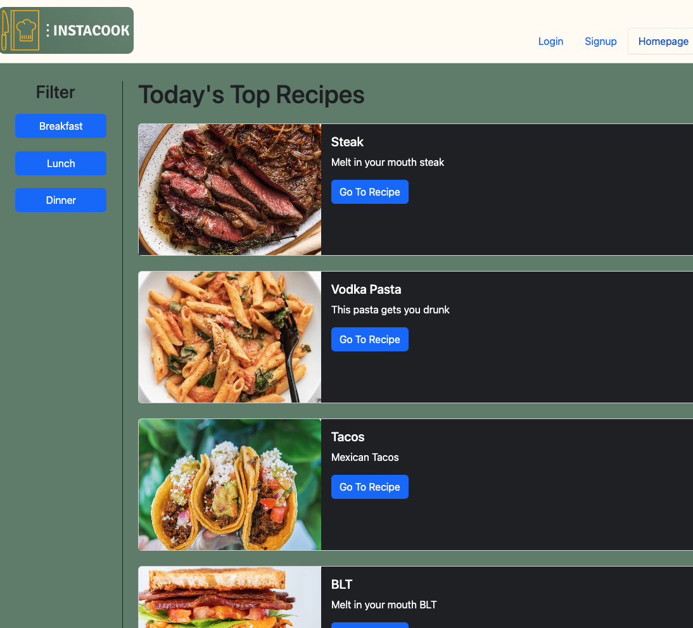
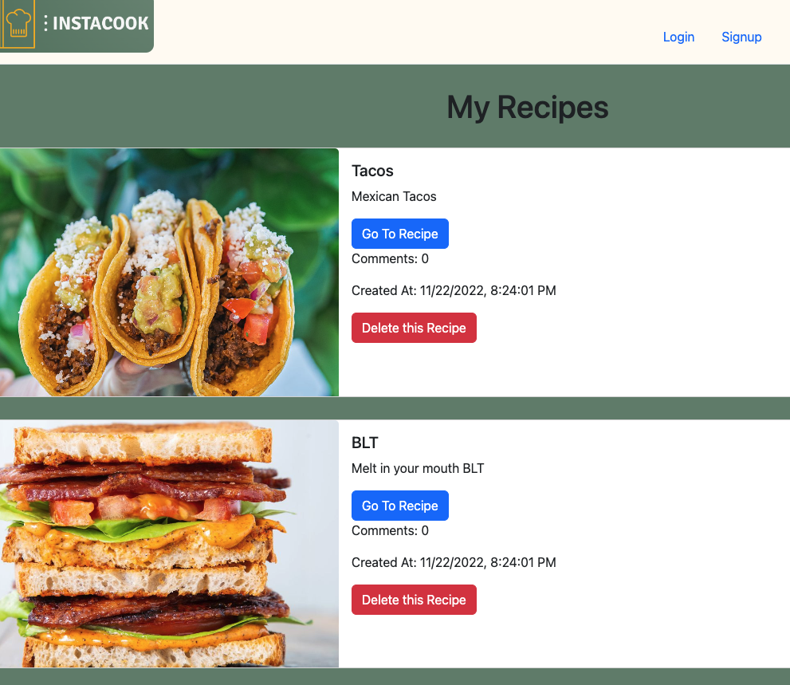
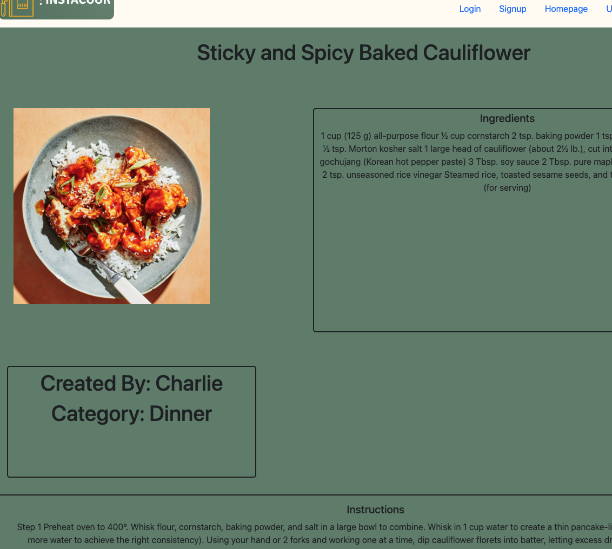
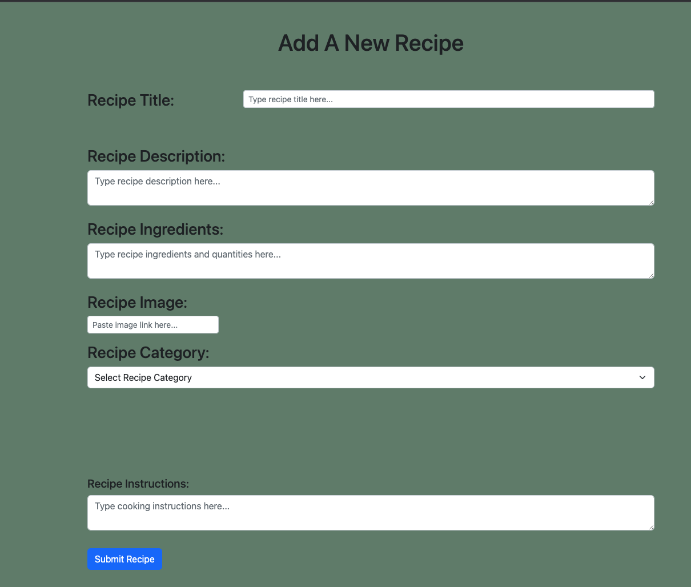
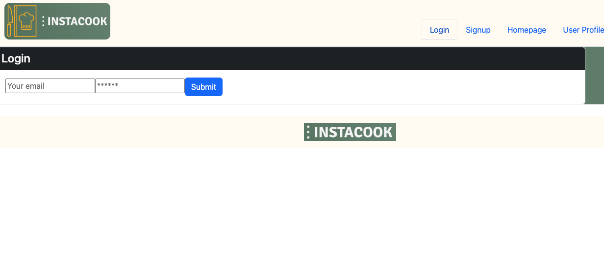

# Instacook

## Project Description

Instacook is a recipe sharing app. It features user authentication for users to save a collection of their own created/shared recipes,  as well as delete their own posts if needed. Shared recipes are public and anyone with an account can access posted recipes.

---

## Installation Instructions:
This project is deployed live on Heroku! Visit the site at: https://frozen-chamber-50604.herokuapp.com/

---

## Tech Stack:
* React.js
* JavaScript
* HTML
* CSS
* React-Bootstrap
* Node.js
* Express.js
* GraphQL
* Apollo-Server
* Mongoose
* MongoDB
* JWT
* Bcrypt
* Heroku

---

## Project Contributors:

* Kent Shaffer @ GitHub: (https://github.com/kentshaffer)
* Charles Molitor @ GitHub: (https://github.com/CMolitor96)
* Mario Ulloa @ GitHub: (https://github.com/Mulloa90)
* Austin Smittle @ GitHub: (https://github.com/asmitt8373)

---

## Questions: 

GitHub Repository: (https://github.com/CMolitor96/instacook)

Please email me at (charlie.molitor.38@gmail.com) for any further questions regarding this application.

---
## Screenshots of app:

---